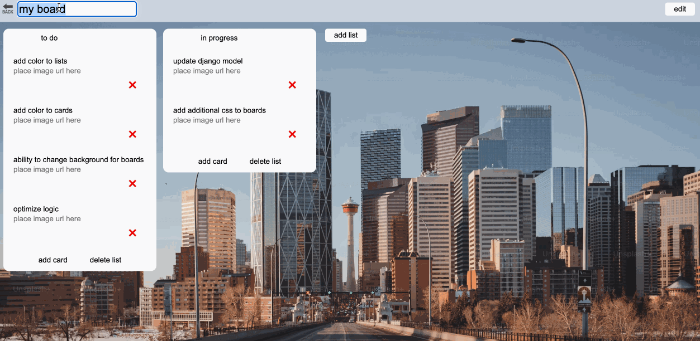

# Kanban Board

A full-stack Kanban board built with Django, React and dnd kit.

- Create, edit, manage multiple boards, each with a customizable background (color or image)
- Create, edit, drag-and-drop mutiple lists and cards
- display images in each card

## Tech Stack

**Backend**

- Django 6.0
- Django REST Framework
- SQLite
- django-vite
- django-environ

**Frontend**

- React
- Vite
- TanStack Router
- TanStack Query
- dnd kit

## Gallery

### Boards

### Board

### Drag and Drop

### Lists and Cards

